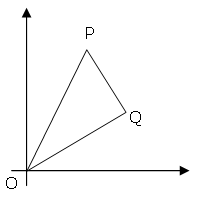
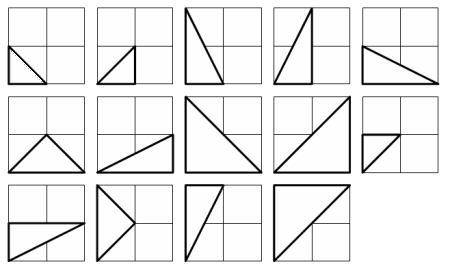

# Problem 091: Right Triangles with Integer Coordinates

The points $P(x\_1, y\_1)$ and $Q(x\_2, y\_2)$ are plotted at integer co-ordinates and are joined to the origin, $O(0,0)$, to form $\\triangle OPQ$.

  

There are exactly fourteen triangles containing a right angle that can be formed when each co-ordinate lies between $0$ and $2$ inclusive; that is, $0 \\le x\_1, y\_1, x\_2, y\_2 \\le 2$.

  

Given that $0 \\le x\_1, y\_1, x\_2, y\_2 \\le 50$, how many right triangles can be formed?
