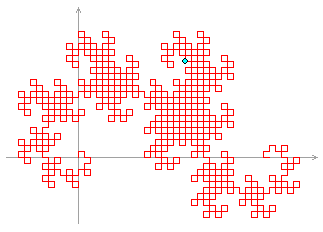

# Problem 220: Heighway Dragon

Let $D\_0$ be the two-letter string "Fa". For $n\\ge 1$, derive $D\_n$ from $D\_{n-1}$ by the string-rewriting rules:

"a" → "aRbFR"  
"b" → "LFaLb"

Thus, $D\_0 = $ "Fa", $D\_1 = $ "FaRbFR", $D\_2 = $ "FaRbFRRLFaLbFR", and so on.

These strings can be interpreted as instructions to a computer graphics program, with "F" meaning "draw forward one unit", "L" meaning "turn left $90$ degrees", "R" meaning "turn right $90$ degrees", and "a" and "b" being ignored. The initial position of the computer cursor is $(0,0)$, pointing up towards $(0,1)$.

Then $D\_n$ is an exotic drawing known as the **Heighway Dragon** of order $n$. For example, $D\_{10}$ is shown below; counting each "F" as one step, the highlighted spot at $(18,16)$ is the position reached after $500$ steps.

What is the position of the cursor after $10^{12}$ steps in $D\_{50}$?  
Give your answer in the form _x_,_y_ with no spaces.
