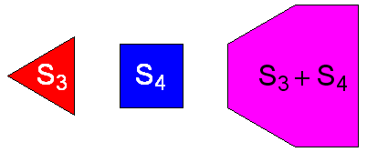

# Problem 228: Minkowski Sums

Let $S\_n$ be the regular $n$-sided polygon – or shape – whose vertices $v\_k$ ($k = 1, 2, \\dots, n$) have coordinates:

$$\\begin{align} x\_k &= \\cos((2k - 1)/n \\times 180^\\circ)\\\\ y\_k &= \\sin((2k - 1)/n \\times 180^\\circ) \\end{align}$$

Each $S\_n$ is to be interpreted as a filled shape consisting of all points on the perimeter and in the interior.

The **Minkowski sum**, $S + T$, of two shapes $S$ and $T$ is the result of adding every point in $S$ to every point in $T$, where point addition is performed coordinate-wise: $(u, v) + (x, y) = (u + x, v + y)$.

For example, the sum of $S\_3$ and $S\_4$ is the six-sided shape shown in pink below:

How many sides does $S\_{1864} + S\_{1865} + \\cdots + S\_{1909}$ have?
