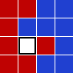
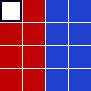

# Problem 244: Sliders

You probably know the game **Fifteen Puzzle**. Here, instead of numbered tiles, we have seven red tiles and eight blue tiles.

A move is denoted by the uppercase initial of the direction (Left, Right, Up, Down) in which the tile is slid, e.g. starting from configuration (**S**), by the sequence **LULUR** we reach the configuration (**E**):

<table cellspacing="0" cellpadding="2" border="0" align="center"><tbody><tr><td width="25">(<b>S</b>)</td><td width="100"></td><td width="25">,&nbsp;(<b>E</b>)</td><td width="100"></td></tr></tbody></table>

For each path, its checksum is calculated by (pseudocode):

$$\\begin{align} \\mathrm{checksum} &= 0\\\\ \\mathrm{checksum} &= (\\mathrm{checksum} \\times 243 + m\_1) \\bmod 100\\,000\\,007\\\\ \\mathrm{checksum} &= (\\mathrm{checksum} \\times 243 + m\_2) \\bmod 100\\,000\\,007\\\\ \\cdots &\\\\ \\mathrm{checksum} &= (\\mathrm{checksum} \\times 243 + m\_n) \\bmod 100\\,000\\,007 \\end{align}$$ where $m\_k$ is the ASCII value of the $k$<var>th</var> letter in the move sequence and the ASCII values for the moves are:

<table cellspacing="0" cellpadding="2" border="1" align="center"><tbody><tr><td width="30"><b>L</b></td><td width="30">76</td></tr><tr><td><b>R</b></td><td>82</td></tr><tr><td><b>U</b></td><td>85</td></tr><tr><td><b>D</b></td><td>68</td></tr></tbody></table>

For the sequence **LULUR** given above, the checksum would be $19761398$.

Now, starting from configuration (**S**), find all shortest ways to reach configuration (**T**).

<table cellspacing="0" cellpadding="2" border="0" align="center"><tbody><tr><td width="25">(<b>S</b>)</td><td width="100"></td><td width="25">,&nbsp;(<b>T</b>)</td><td width="100"></td></tr></tbody></table>

What is the sum of all checksums for the paths having the minimal length?
