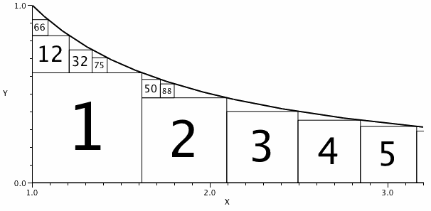

# Problem 247: Squares Under a Hyperbola

Consider the region constrained by $1 \\le x$ and $0 \\le y \\le 1/x$.

Let $S\_1$ be the largest square that can fit under the curve.  
Let $S\_2$ be the largest square that fits in the remaining area, and so on.  
Let the index of $S\_n$ be the pair $(\\text{left}, \\text{below})$ indicating the number of squares to the left of $S\_n$ and the number of squares below $S\_n$.

The diagram shows some such squares labelled by number.  
$S\_2$ has one square to its left and none below, so the index of $S\_2$ is $(1,0)$.  
It can be seen that the index of $S\_{32}$ is $(1,1)$ as is the index of $S\_{50}$.  
$50$ is the largest $n$ for which the index of $S\_n$ is $(1,1)$.

What is the largest $n$ for which the index of $S\_n$ is $(3,3)$?
