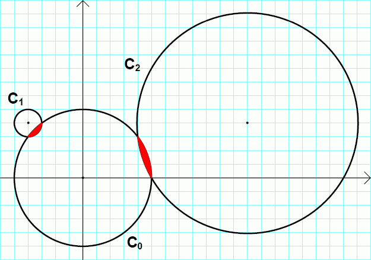

# Problem 295: Lenticular Holes

We call the convex area enclosed by two circles a lenticular hole if:

-   The centres of both circles are on lattice points.
-   The two circles intersect at two distinct lattice points.
-   The interior of the convex area enclosed by both circles does not contain any lattice points.

Consider the circles:  
$C\_0$: $x^2 + y^2 = 25$  
$C\_1$: $(x + 4)^2 + (y - 4)^2 = 1$  
$C\_2$: $(x - 12)^2 + (y - 4)^2 = 65$

The circles $C\_0$, $C\_1$ and $C\_2$ are drawn in the picture below.

$C\_0$ and $C\_1$ form a lenticular hole, as well as $C\_0$ and $C\_2$.

We call an ordered pair of positive real numbers $(r\_1, r\_2)$ a lenticular pair if there exist two circles with radii $r\_1$ and $r\_2$ that form a lenticular hole. We can verify that $(1, 5)$ and $(5, \\sqrt{65})$ are the lenticular pairs of the example above.

Let $L(N)$ be the number of **distinct** lenticular pairs $(r\_1, r\_2)$ for which $0 \\lt r\_1 \\le r\_2 \\le N$.  
We can verify that $L(10) = 30$ and $L(100) = 3442$.

Find $L(100\\,000)$.
