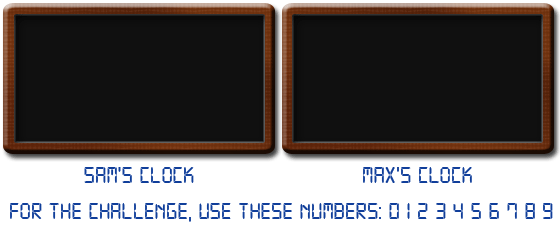

# Problem 315: Digital Root Clocks

Sam and Max are asked to transform two digital clocks into two "digital root" clocks.  
A digital root clock is a digital clock that calculates digital roots step by step.

When a clock is fed a number, it will show it and then it will start the calculation, showing all the intermediate values until it gets to the result.  
For example, if the clock is fed the number 137, it will show: "**137**" → "**11**" → "**2**" and then it will go black, waiting for the next number.

Every digital number consists of some light segments: three horizontal (top, middle, bottom) and four vertical (top-left, top-right, bottom-left, bottom-right).  
Number "**1**" is made of vertical top-right and bottom-right, number "**4**" is made by middle horizontal and vertical top-left, top-right and bottom-right. Number "**8**" lights them all.

The clocks consume energy only when segments are turned on/off.  
To turn on a "**2**" will cost 5 transitions, while a "**7**" will cost only 4 transitions.

Sam and Max built two different clocks.

Sam's clock is fed e.g. number 137: the clock shows "**137**", then the panel is turned off, then the next number ("**11**") is turned on, then the panel is turned off again and finally the last number ("**2**") is turned on and, after some time, off.  
For the example, with number 137, Sam's clock requires:  

<table><tbody><tr><td>"<b>137</b>"</td><td>:</td><td>(2 + 5 + 4) × 2 = 22 transitions ("<b>137</b>" on/off).</td></tr><tr><td>"<b>11</b>"</td><td>:</td><td>(2 + 2) × 2 = 8 transitions ("<b>11</b>" on/off).</td></tr><tr><td>"<b>2</b>"</td><td>:</td><td>(5) × 2 = 10 transitions ("<b>2</b>" on/off).</td></tr></tbody></table>

For a grand total of 40 transitions.

Max's clock works differently. Instead of turning off the whole panel, it is smart enough to turn off only those segments that won't be needed for the next number.  
For number 137, Max's clock requires:  

<table><tbody><tr><td>"<b>137</b>"  </td><td>:  </td><td>2 + 5 + 4 = 11 transitions ("<b>137</b>" on) 7 transitions (to turn off the segments that are not needed for number "<b>11</b>").</td></tr><tr><td>"<b>11</b>"   </td><td>:   </td><td>0 transitions (number "<b>11</b>" is already turned on correctly) 3 transitions (to turn off the first "<b>1</b>" and the bottom part of the second "<b>1</b>"; the top part is common with number "<b>2</b>").</td></tr><tr><td>"<b>2</b>"  </td><td>:  </td><td>4 transitions (to turn on the remaining segments in order to get a "<b>2</b>") 5 transitions (to turn off number "<b>2</b>").</td></tr></tbody></table>

For a grand total of 30 transitions.

Of course, Max's clock consumes less power than Sam's one.  
The two clocks are fed all the prime numbers between A = 107 and B = 2×107.  
Find the difference between the total number of transitions needed by Sam's clock and that needed by Max's one.
