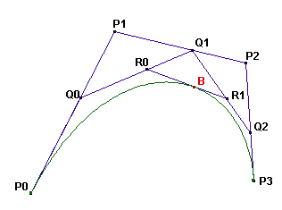

# Problem 363: Bézier Curves

A cubic Bézier curve is defined by four points: $P\_0, P\_1, P\_2,$ and $P\_3$.

The curve is constructed as follows:

On the segments $P\_0 P\_1$, $P\_1 P\_2$, and $P\_2 P\_3$ the points $Q\_0, Q\_1,$ and $Q\_2$ are drawn such that $\\dfrac{P\_0 Q\_0}{P\_0 P\_1} = \\dfrac{P\_1 Q\_1}{P\_1 P\_2} = \\dfrac{P\_2 Q\_2}{P\_2 P\_3} = t$, with $t$ in $\[0, 1\]$.

On the segments $Q\_0 Q\_1$ and $Q\_1 Q\_2$ the points $R\_0$ and $R\_1$ are drawn such that  
$\\dfrac{Q\_0 R\_0}{Q\_0 Q\_1} = \\dfrac{Q\_1 R\_1}{Q\_1 Q\_2} = t$ for the same value of $t$.

On the segment $R\_0 R\_1$ the point $B$ is drawn such that $\\dfrac{R\_0 B}{R\_0 R\_1} = t$ for the same value of $t$.

The Bézier curve defined by the points $P\_0, P\_1, P\_2, P\_3$ is the locus of $B$ as $Q\_0$ takes all possible positions on the segment $P\_0 P\_1$.  
(Please note that for all points the value of $t$ is the same.)

From the construction it is clear that the Bézier curve will be tangent to the segments $P\_0 P\_1$ in $P\_0$ and $P\_2 P\_3$ in $P\_3$.

A cubic Bézier curve with $P\_0 = (1, 0), P\_1 = (1, v), P\_2 = (v, 1),$ and $P\_3 = (0, 1)$ is used to approximate a quarter circle.  
The value $v \\gt 0$ is chosen such that the area enclosed by the lines $O P\_0, OP\_3$ and the curve is equal to $\\dfrac{\\pi}{4}$ (the area of the quarter circle).

By how many percent does the length of the curve differ from the length of the quarter circle?  
That is, if $L$ is the length of the curve, calculate $100 \\times \\dfrac{L - \\frac{\\pi}{2}}{\\frac{\\pi}{2}}$  
Give your answer rounded to 10 digits behind the decimal point.
