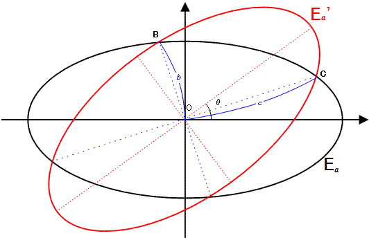

# Problem 404: Crisscross Ellipses

$E\_a$ is an ellipse with an equation of the form $x^2 + 4y^2 = 4a^2$.  
$E\_a^\\prime$ is the rotated image of $E\_a$ by $\\theta$ degrees counterclockwise around the origin $O(0, 0)$ for $0^\\circ \\lt \\theta \\lt 90^\\circ$.

$b$ is the distance to the origin of the two intersection points closest to the origin and $c$ is the distance of the two other intersection points.  
We call an ordered triplet $(a, b, c)$ a canonical ellipsoidal triplet if $a, b$ and $c$ are positive integers.  
For example, $(209, 247, 286)$ is a canonical ellipsoidal triplet.

Let $C(N)$ be the number of distinct canonical ellipsoidal triplets $(a, b, c)$ for $a \\leq N$.  
It can be verified that $C(10^3) = 7$, $C(10^4) = 106$ and $C(10^6) = 11845$.

Find $C(10^{17})$.
