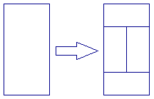
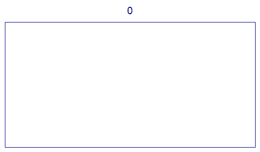

# Problem 405: A Rectangular Tiling

We wish to tile a rectangle whose length is twice its width.  
Let $T(0)$ be the tiling consisting of a single rectangle.  
For $n \\gt 0$, let $T(n)$ be obtained from $T(n-1)$ by replacing all tiles in the following manner:

The following animation demonstrates the tilings $T(n)$ for $n$ from $0$ to $5$:

Let $f(n)$ be the number of points where four tiles meet in $T(n)$.  
For example, $f(1) = 0$, $f(4) = 82$ and $f(10^9) \\bmod 17^7 = 126897180$.

Find $f(10^k)$ for $k = 10^{18}$, give your answer modulo $17^7$.
