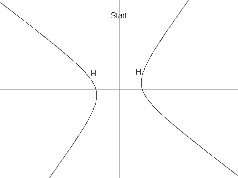

# Problem 422: Sequence of Points on a Hyperbola

Let $H$ be the hyperbola defined by the equation $12x^2 + 7xy - 12y^2 = 625$.

Next, define $X$ as the point $(7, 1)$. It can be seen that $X$ is in $H$.

Now we define a sequence of points in $H$, $\\{P\_i: i \\geq 1\\}$, as:

-   $P\_1 = (13, 61/4)$.
-   $P\_2 = (-43/6, -4)$.
-   For $i \\gt 2$, $P\_i$ is the unique point in $H$ that is different from $P\_{i-1}$ and such that line $P\_iP\_{i-1}$ is parallel to line $P\_{i-2}X$. It can be shown that $P\_i$ is well-defined, and that its coordinates are always rational.

You are given that $P\_3 = (-19/2, -229/24)$, $P\_4 = (1267/144, -37/12)$ and $P\_7 = (17194218091/143327232, 274748766781/1719926784)$.

Find $P\_n$ for $n = 11^{14}$ in the following format:  
If $P\_n = (a/b, c/d)$ where the fractions are in lowest terms and the denominators are positive, then the answer is $(a + b + c + d) \\bmod 1\\,000\\,000\\,007$.

For $n = 7$, the answer would have been: $806236837$.
