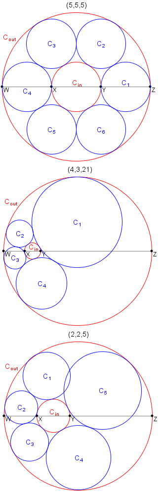

# Problem 428: Necklace of Circles

Let $a$, $b$ and $c$ be positive numbers.  
Let $W, X, Y, Z$ be four collinear points where $|WX| = a$, $|XY| = b$, $|YZ| = c$ and $|WZ| = a + b + c$.  
Let $C\_{in}$ be the circle having the diameter $XY$.  
Let $C\_{out}$ be the circle having the diameter $WZ$.  

The triplet $(a, b, c)$ is called a necklace triplet if you can place $k \\geq 3$ distinct circles $C\_1, C\_2, \\dots, C\_k$ such that:

-   $C\_i$ has no common interior points with any $C\_j$ for $1 \\leq i, j \\leq k$ and $i \\neq j$,
-   $C\_i$ is tangent to both $C\_{in}$ and $C\_{out}$ for $1 \\leq i \\leq k$,
-   $C\_i$ is tangent to $C\_{i+1}$ for $1 \\leq i \\lt k$, and
-   $C\_k$ is tangent to $C\_1$.

For example, $(5, 5, 5)$ and $(4, 3, 21)$ are necklace triplets, while it can be shown that $(2, 2, 5)$ is not.

Let $T(n)$ be the number of necklace triplets $(a, b, c)$ such that $a$, $b$ and $c$ are positive integers, and $b \\leq n$. For example, $T(1) = 9$, $T(20) = 732$ and $T(3000) = 438106$.

Find $T(1\\,000\\,000\\,000)$.
