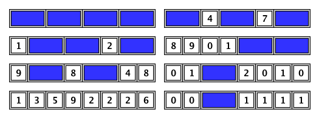

# Problem 440: GCD and Tiling

We want to tile a board of length $n$ and height $1$ completely, with either $1 \\times 2$ blocks or $1 \\times 1$ blocks with a single decimal digit on top:

For example, here are some of the ways to tile a board of length $n = 8$:

Let $T(n)$ be the number of ways to tile a board of length $n$ as described above.

For example, $T(1) = 10$ and $T(2) = 101$.

Let $S(L)$ be the triple sum $\\sum\_{a, b, c}\\gcd(T(c^a), T(c^b))$ for $1 \\leq a, b, c \\leq L$.  
For example:  
$S(2) = 10444$  
$S(3) = 1292115238446807016106539989$  
$S(4) \\bmod 987\\,898\\,789 = 670616280$.

Find $S(2000) \\bmod 987\\,898\\,789$.
