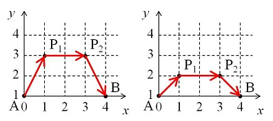

# Problem 460: An Ant on the Move

On the Euclidean plane, an ant travels from point $A(0, 1)$ to point $B(d, 1)$ for an integer $d$.

In each step, the ant at point $(x\_0, y\_0)$ chooses one of the lattice points $(x\_1, y\_1)$ which satisfy $x\_1 \\ge 0$ and $y\_1 \\ge 1$ and goes straight to $(x\_1, y\_1)$ at a constant velocity $v$. The value of $v$ depends on $y\_0$ and $y\_1$ as follows:

-   If $y\_0 = y\_1$, the value of $v$ equals $y\_0$.
-   If $y\_0 \\ne y\_1$, the value of $v$ equals $(y\_1 - y\_0) / (\\ln(y\_1) - \\ln(y\_0))$.

The left image is one of the possible paths for $d = 4$. First the ant goes from $A(0, 1)$ to $P\_1(1, 3)$ at velocity $(3 - 1) / (\\ln(3) - \\ln(1)) \\approx 1.8205$. Then the required time is $\\sqrt 5 / 1.8205 \\approx 1.2283$.  
From $P\_1(1, 3)$ to $P\_2(3, 3)$ the ant travels at velocity $3$ so the required time is $2 / 3 \\approx 0.6667$. From $P\_2(3, 3)$ to $B(4, 1)$ the ant travels at velocity $(1 - 3) / (\\ln(1) - \\ln(3)) \\approx 1.8205$ so the required time is $\\sqrt 5 / 1.8205 \\approx 1.2283$.  
Thus the total required time is $1.2283 + 0.6667 + 1.2283 = 3.1233$.

The right image is another path. The total required time is calculated as $0.98026 + 1 + 0.98026 = 2.96052$. It can be shown that this is the quickest path for $d = 4$.

Let $F(d)$ be the total required time if the ant chooses the quickest path. For example, $F(4) \\approx 2.960516287$.  
We can verify that $F(10) \\approx 4.668187834$ and $F(100) \\approx 9.217221972$.

Find $F(10000)$. Give your answer rounded to nine decimal places.
