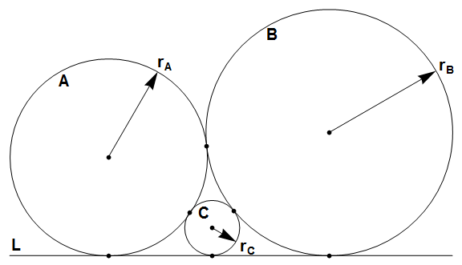

# Problem 510: Tangent Circles

Circles $A$ and $B$ are tangent to each other and to line $L$ at three distinct points.  
Circle $C$ is inside the space between $A$, $B$ and $L$, and tangent to all three.  
Let $r\_A$, $r\_B$ and $r\_C$ be the radii of $A$, $B$ and $C$ respectively.  

Let $S(n) = \\sum r\_A + r\_B + r\_C$, for $0 \\lt r\_A \\le r\_B \\le n$ where $r\_A$, $r\_B$ and $r\_C$ are integers. The only solution for $0 \\lt r\_A \\le r\_B \\le 5$ is $r\_A = 4$, $r\_B = 4$ and $r\_C = 1$, so $S(5) = 4 + 4 + 1 = 9$. You are also given $S(100) = 3072$.

Find $S(10^9)$.
