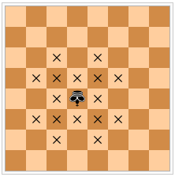

# Problem 554: Centaurs on a Chess Board

On a chess board, a centaur moves like a king or a knight. The diagram below shows the valid moves of a centaur (represented by an inverted king) on an $8 \\times 8$ board.

It can be shown that at most $n^2$ non-attacking centaurs can be placed on a board of size $2n \\times 2n$.  
Let $C(n)$ be the number of ways to place $n^2$ centaurs on a $2n \\times 2n$ board so that no centaur attacks another directly.  
For example $C(1) = 4$, $C(2) = 25$, $C(10) = 1477721$.

Let $F\_i$ be the $i$th Fibonacci number defined as $F\_1 = F\_2 = 1$ and $F\_i = F\_{i - 1} + F\_{i - 2}$ for $i \\gt 2$.

Find $\\displaystyle \\left( \\sum\_{i=2}^{90} C(F\_i) \\right) \\bmod (10^8+7)$.
