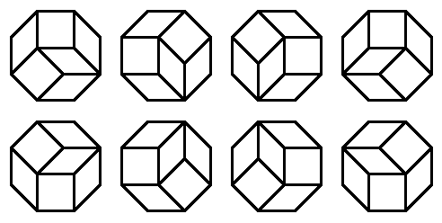
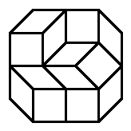

# Problem 594: Rhombus Tilings

For a polygon $P$, let $t(P)$ be the number of ways in which $P$ can be tiled using rhombi and squares with edge length 1. Distinct rotations and reflections are counted as separate tilings.

For example, if $O$ is a regular octagon with edge length 1, then $t(O) = 8$. As it happens, all these 8 tilings are rotations of one another:

Let $O\_{a,b}$ be the equal-angled convex octagon whose edges alternate in length between $a$ and $b$.  
For example, here is $O\_{2,1}$, with one of its tilings:

You are given that $t(O\_{1,1})=8$, $t(O\_{2,1})=76$ and $t(O\_{3,2})=456572$.

Find $t(O\_{4,2})$.
