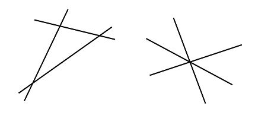

# Problem 630: Crossed Lines

Given a set, $L$, of unique lines, let $M(L)$ be the number of lines in the set and let $S(L)$ be the sum over every line of the number of times that line is crossed by another line in the set. For example, two sets of three lines are shown below:

In both cases $M(L)$ is $3$ and $S(L)$ is $6$: each of the three lines is crossed by two other lines. Note that even if the lines cross at a single point, all of the separate crossings of lines are counted.

Consider points $(T\_{2k-1}, T\_{2k})$, for integer $k \\ge 1$, generated in the following way:

$S\_0 = 290797$  
$S\_{n+1} = S\_n^2 \\bmod 50515093$  
$T\_n = (S\_n \\bmod 2000) - 1000$

For example, the first three points are: $(527, 144)$, $(-488, 732)$, $(-454, -947)$. Given the first $n$ points generated in this manner, let $L\_n$ be the set of **unique** lines that can be formed by joining each point with every other point, the lines being extended indefinitely in both directions. We can then define $M(L\_n)$ and $S(L\_n)$ as described above.

For example, $M(L\_3) = 3$ and $S(L\_3) = 6$. Also $M(L\_{100}) = 4948$ and $S(L\_{100}) = 24477690$.

Find $S(L\_{2500})$.
