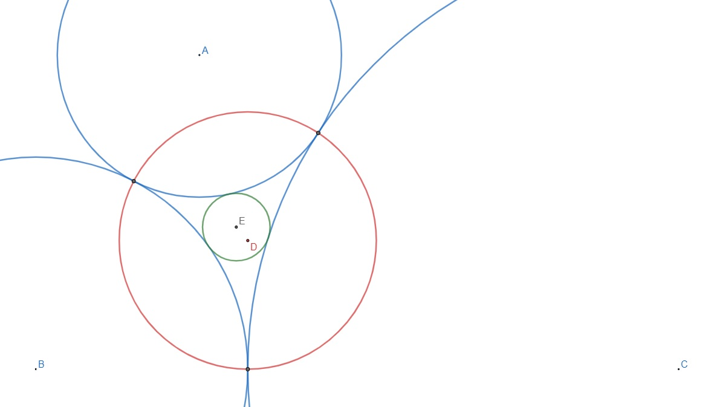

# Problem 727: Triangle of Circular Arcs

Let $r\_a$, $r\_b$ and $r\_c$ be the radii of three circles that are mutually and externally tangent to each other. The three circles then form a triangle of circular arcs between their tangency points as shown for the three blue circles in the picture below.

Define the circumcircle of this triangle to be the red circle, with centre $D$, passing through their tangency points. Further define the incircle of this triangle to be the green circle, with centre $E$, that is mutually and externally tangent to all the three blue circles. Let $d=\\vert DE \\vert$ be the distance between the centres of the circumcircle and the incircle.

Let $\\mathbb{E}(d)$ be the expected value of $d$ when $r\_a$, $r\_b$ and $r\_c$ are integers chosen uniformly such that $1\\leq r\_a<r\_b<r\_c \\leq 100$ and $\\text{gcd}(r\_a,r\_b,r\_c)=1$.

Find $\\mathbb{E}(d)$, rounded to eight places after the decimal point.
