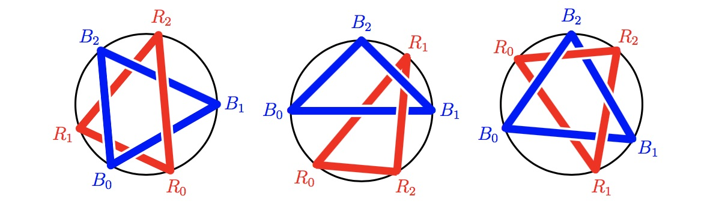

# Problem 807: Loops of Ropes

Given a circle $C$ and an integer $n > 1$, we perform the following operations.

In step $0$, we choose two uniformly random points $R\_0$ and $B\_0$ on $C$.  
In step $i$ ($1 \\leq i < n$), we first choose a uniformly random point $R\_i$ on $C$ and connect the points $R\_{i - 1}$ and $R\_i$ with a red rope; then choose a uniformly random point $B\_i$ on $C$ and connect the points $B\_{i - 1}$ and $B\_i$ with a blue rope.  
In step $n$, we first connect the points $R\_{n - 1}$ and $R\_0$ with a red rope; then connect the points $B\_{n - 1}$ and $B\_0$ with a blue rope.  
Each rope is straight between its two end points, and lies above all previous ropes.

After step $n$, we get a loop of red ropes, and a loop of blue ropes.  
Sometimes the two loops can be separated, as in the left figure below; sometimes they are "linked", hence cannot be separated, as in the middle and right figures below.

Let $P(n)$ be the probability that the two loops can be separated.  
For example, $P(3) = \\frac{11}{20}$ and $P(5) \\approx 0.4304177690$.

Find $P(80)$, rounded to $10$ digits after decimal point.
