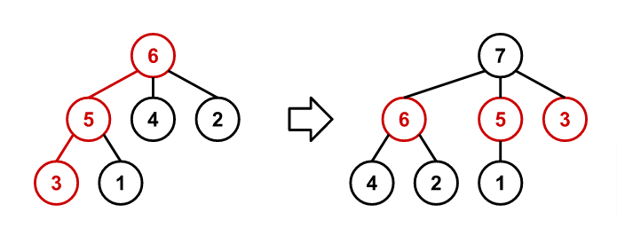

# Problem 872: Recursive Tree

A sequence of rooted trees $T\_n$ is constructed such that $T\_n$ has $n$ nodes numbered $1$ to $n$.

The sequence starts at $T\_1$, a tree with a single node as a root with the number $1$.

For $n > 1$, $T\_n$ is constructed from $T\_{n-1}$ using the following procedure:

1.  Trace a path from the root of $T\_{n-1}$ to a leaf by following the largest-numbered child at each node.
2.  Remove all edges along the traced path, disconnecting all nodes along it from their parents.
3.  Connect all orphaned nodes directly to a new node numbered $n$, which becomes the root of $T\_n$.

For example, the following figure shows $T\_6$ and $T\_7$. The path traced through $T\_6$ during the construction of $T\_7$ is coloured red.

Let $f(n, k)$ be the sum of the node numbers along the path connecting the root of $T\_n$ to the node $k$, including the root and the node $k$. For example, $f(6, 1) = 6 + 5 + 1 = 12$ and $f(10, 3) = 29$.

Find $f(10^{17}, 9^{17})$.
