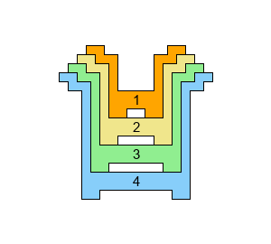
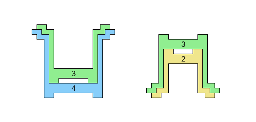
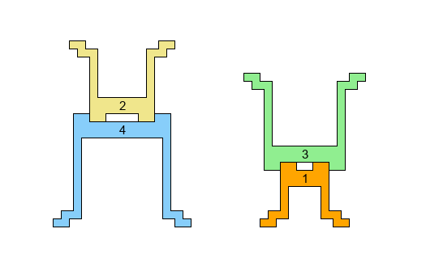
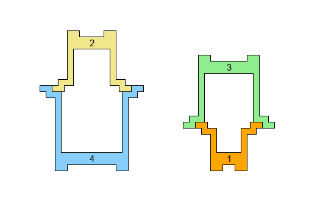
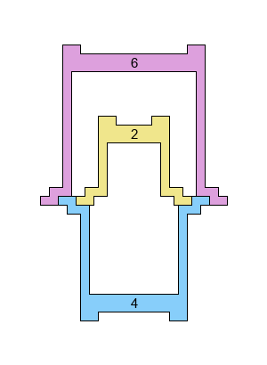

# Problem 907: Stacking Cups

An infant's toy consists of $n$ cups, labelled $C\_1,\\dots,C\_n$ in increasing order of size.

The cups may be stacked in various combinations and orientations to form towers. The cups are shaped such that the following means of stacking are possible:

-   Nesting: $C\_k$ may sit snugly inside $C\_{k+1}$.  
    
-   Base-to-base: $C\_{k+2}$ or $C\_{k-2}$ may sit, right-way-up, on top of an up-side-down $C\_k$, with their bottoms fitting together snugly.  
    
-   Rim-to-rim: $C\_{k+2}$ or $C\_{k-2}$ may sit, up-side-down, on top of a right-way-up $C\_k$, with their tops fitting together snugly.  
    
-   For the purposes of this problem, it is **not** permitted to stack **both** $C\_{k+2}$ and $C\_{k-2}$ rim-to-rim on top of $C\_k$, despite the schematic diagrams appearing to allow it:  
      
    

Define $S(n)$ to be the number of ways to build a single tower using all $n$ cups according to the above rules.  
You are given $S(4)=12$, $S(8)=58$, and $S(20)=5560$.

Find $S(10^7)$, giving your answer modulo $1\\,000\\,000\\,007$.
