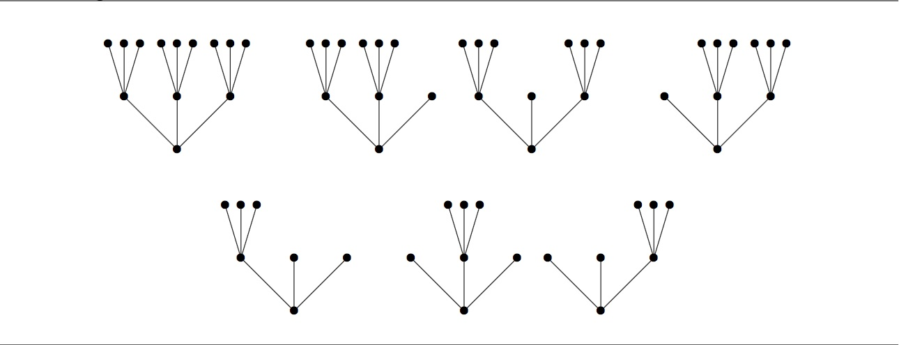

# Problem 927: Prime-ary Tree

A full $k$-ary tree is a tree with a single root node, such that every node is either a leaf or has exactly $k$ ordered children. The **height** of a $k$-ary tree is the number of edges in the longest path from the root to a leaf.

For instance, there is one full 3-ary tree of height 0, one full 3-ary tree of height 1, and seven full 3-ary trees of height 2. These seven are shown below.

For integers $n$ and $k$ with $n\\ge 0$ and $k \\ge 2$, define $t\_k(n)$ to be the number of full $k$-ary trees of height $n$ or less.  
Thus, $t\_3(0) = 1$, $t\_3(1) = 2$, and $t\_3(2) = 9$. Also, $t\_2(0) = 1$, $t\_2(1) = 2$, and $t\_2(2) = 5$.

Define $S\_k$ to be the set of positive integers $m$ such that $m$ divides $t\_k(n)$ for some integer $n\\ge 0$. For instance, the above values show that 1, 2, and 5 are in $S\_2$ and 1, 2, 3, and 9 are in $S\_3$.

Let $S = \\bigcap\_p S\_p$ where the intersection is taken over all primes $p$. Finally, define $R(N)$ to be the sum of all elements of $S$ not exceeding $N$. You are given that $R(20) = 18$ and $R(1000) = 2089$.

Find $R(10^7)$.
