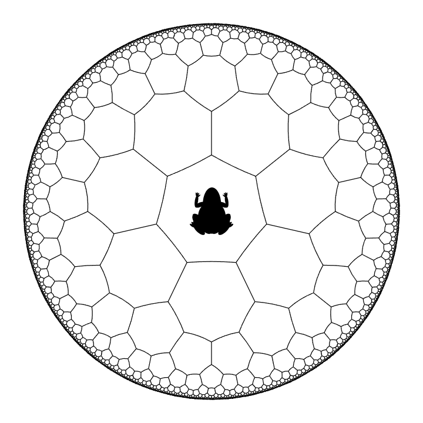

# Problem 979: Heptagon Hopping

The **hyperbolic plane**, represented by the **open unit disc**, can be tiled by heptagons. Every tile is a hyperbolic heptagon (i.e. it has seven edges which are segments of **geodesics** in the hyperbolic plane) and every vertex is shared by three tiles.  
Please refer to [Problem 972](problem=972) for some of the definitions.

The diagram below shows an illustration of this tiling.

Now, a hyperbolic frog starts from one of the heptagons, as shown in the diagram. At each step, it can jump to any one of the seven adjacent tiles.

Define $F(n)$ to be the number of paths the frog can trace so that after $n$ steps it lands back at the starting tile.  
You are given $F(4) = 119$.

Find $F(20)$.
