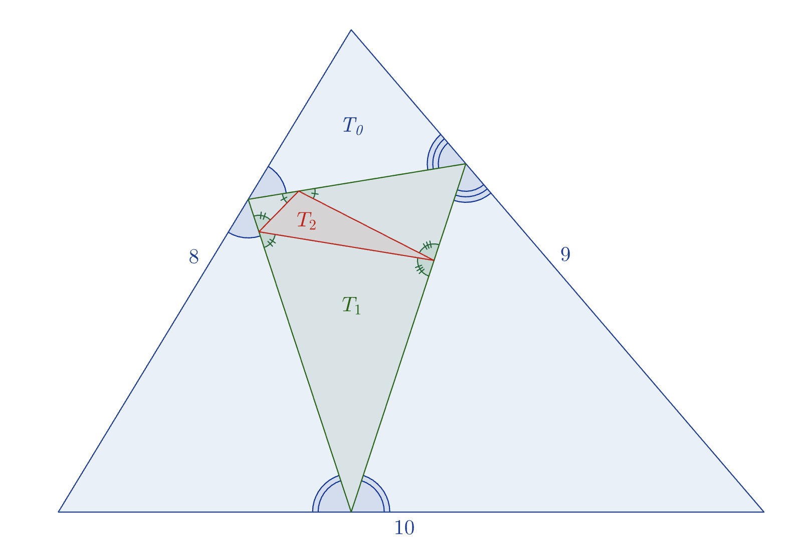

# Problem 985: Telescoping Triangles

Given a triangle $T\_k$, it is sometimes possible to construct a triangle $T\_{k+1}$ inside $T\_k$ such that

-   The three vertices of $T\_{k+1}$ lie one on each side of $T\_k$.
-   For each side of $T\_k$, the angles formed between it and the two sides of $T\_{k+1}$ it touches are equal to each other.

Illustrated above is such a sequence of three triangles starting with $T\_0$ (in blue) having side lengths $(8,9,10)$. Then $T\_1$ is shown in green and $T\_2$ in red. However, no triangle can be drawn inside $T\_2$ that satisfies the requirements. In other words, $T\_3$ does not exist.

Amongst all integer-sided triangles $T\_0$ such that $T\_2$ exists but $T\_3$ does not exist, the smallest possible perimeter is $10$ when $T\_0$ has side lengths $(3, 3, 4)$.

Suppose another triangle $T\_0$ has integer side lengths, and $T\_{20}$ exists, but $T\_{21}$ does not exist. What is the smallest possible perimeter of $T\_0$?
